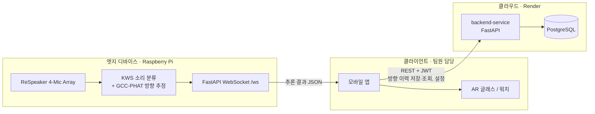

# Hearing Assistant — 청각장애인 생활 보조 시스템 (서버)

> 주변의 위험 소리를 놓치기 쉬운 청각장애인을 위해, 엣지 디바이스가 **소리 종류와 방향을 실시간으로 판별**하고 모바일·AR 글래스·워치로 알려주는 시스템의 **서버 레포지토리**입니다.


| 항목 | 내용 |
|---|---|
| 기간 | 2026.03 ~ 2026.06 |
| 유형 | 심화 캡스톤디자인 (팀 프로젝트) |
| 팀 구성 | 5명 |
| 내 역할 | **팀장 · 서버 아키텍처 · 배포 · AI 서버 개발** |
| 관련 논문 | 「실시간 소리 인식 및 방향 추정을 활용한 청각장애인 생활 보조 시스템 설계 및 구현」, 한국정보기술학회 2026 (공동 1저자) |

### 레포 구성

| 레포 | 역할 |
|---|---|
| **hearing-assistant** (이 레포) | 메인 백엔드 API, PostgreSQL, 배포 설정 |
| [deafassist_ai_server](https://github.com/alberione1110/deafassist_ai_server) | 라즈베리파이 엣지 AI 서버 (Keyword Spotting + GCC-PHAT 방향 추정, WebSocket) |
| 모바일 앱 · AR 글래스 | 팀원 담당, 별도 관리 |

---

## 핵심 기능

1. **위험 소리 분류 + 8방향 추정**: ReSpeaker 4-Mic Array 입력으로 8종 소리를 분류하고 GCC-PHAT으로 방향을 추정 (AI 서버)
2. **실시간 결과 전송**: AI 서버가 WebSocket으로 추론 결과를 모바일 앱에 즉시 전달
3. **JWT 인증**: 회원가입·로그인·토큰 재발급 (Access 30분 / Refresh 7일)
4. **방향 감지 이력**: 사용자별 저장·조회, 페이지네이션과 방향·날짜 범위 필터, `created_at` 인덱스
5. **사용자 설정**: 자막 글자 크기, 워치 진동 패턴(OFF/SINGLE/DOUBLE/LONG), AR 글래스 자동 전환

<!-- 스크린샷/GIF 자리: Swagger 화면, 앱에서 방향 알림이 뜨는 화면, 하드웨어(ReSpeaker + 라즈베리파이) 사진 -->

---

## 아키텍처



### 설계 선택 이유

- **실시간 추론과 데이터 저장을 분리했습니다.** 소리 분류와 방향 추정은 마이크가 연결된 엣지에서 처리하고 결과를 같은 네트워크의 앱으로 바로 보냅니다. 클라우드 백엔드는 이력 저장과 사용자 설정만 맡습니다. 초기에는 `ai-service`가 이 모노레포 안에서 이벤트를 받아 백엔드로 전달하는 구조였지만, 2026-04에 엣지 레포로 분리했습니다.
- **Alembic으로 스키마를 관리합니다.** 컨테이너가 시작될 때 `alembic upgrade head`를 실행해 배포 환경의 DB 스키마를 코드와 맞춥니다.
- **Render Blueprint(`render.yaml`)로 배포를 선언적으로 관리합니다.** 웹 서비스와 PostgreSQL을 함께 정의하고, DB 접속 문자열은 `fromDatabase`로 주입합니다.

---

## 기술 스택

| 영역 | 기술 |
|---|---|
| Backend | Python 3.11, FastAPI, SQLAlchemy 2.0, Pydantic Settings |
| DB / Migration | PostgreSQL 16, Alembic |
| Auth | python-jose (JWT, HS256), passlib (bcrypt) |
| AI 서버 | PyTorch, Hugging Face Transformers, NumPy (GCC-PHAT), sounddevice |
| Edge | Raspberry Pi, ReSpeaker 4-Mic Array |
| Infra | Docker, Docker Compose, Render |

---

## 내가 맡은 일

**나 (팀장 · 서버)**
- **팀 운영**: 기능 브랜치 → PR → 리뷰 → 머지 흐름을 운영하고, PR 28건을 직접 리뷰·머지
- **서버 아키텍처**: `backend-service` / `ai-service` 모노레포 골격을 설계한 뒤, AI 서비스를 엣지 레포([deafassist_ai_server](https://github.com/alberione1110/deafassist_ai_server))로 분리
- **배포**: Dockerfile과 Docker Compose 로컬 환경 구성, Render Blueprint로 웹 서비스 + PostgreSQL 배포 구성
- **AI 서버**: 소리 분류·방향 추정 파이프라인과 WebSocket 서버 구현. Windows에서 개발한 코드를 그대로 라즈베리파이에 배포해 엣지에서 실행
- **모델**: Keyword Spotting 모델 파인튜닝 (팀원과 공동)
- **초기 ai-service**: 라즈베리파이 이벤트 수신(ingest) 파이프라인 구현, STT 연동 실험

**팀원**
- 회원가입·로그인 JWT 인증과 토큰 재발급 API
- 방향 이력·사용자 설정 테이블과 API, Alembic 도입 및 마이그레이션
- 방향 이력 날짜 범위 필터, `created_at` 인덱스, 진동 타입 변경
- 모바일 앱, AR 글래스 클라이언트

---

<!--
## 트러블슈팅
직접 겪은 사례가 확정되면 아래 형식으로 1~2개 작성
### 제목
- 문제:
- 원인:
- 해결:
- 배운 점:
-->

## API 요약

| Method | Path | 설명 | 인증 |
|---|---|---|---|
| GET | `/health` | 헬스 체크 | - |
| POST | `/api/v1/auth/register` | 회원가입 | - |
| POST | `/api/v1/auth/login` | 로그인 (Access/Refresh 발급) | - |
| POST | `/api/v1/auth/refresh` | 토큰 재발급 | - |
| POST | `/api/v1/directions` | 방향 감지 이력 저장 | JWT |
| GET | `/api/v1/directions` | 이력 조회 (`page`, `size`, `direction`, `date_from`, `date_to`) | JWT |
| GET / PUT | `/api/v1/settings` | 사용자 설정 조회·수정 | JWT |

전체 스키마는 실행 후 `http://localhost:8000/docs`(Swagger UI)에서 확인할 수 있습니다.

---

## 실행 방법

```bash
git clone https://github.com/alberione1110/hearing-assistant.git
cd hearing-assistant

cp .env.example .env          # SECRET_KEY 등 값을 채워 넣기
docker compose up --build
```

| 서비스 | 주소 |
|---|---|
| Backend (Swagger) | http://localhost:8000/docs |
| PostgreSQL | localhost:5432 |

- 컨테이너가 시작될 때 Alembic 마이그레이션이 자동으로 적용됩니다.
- AI 서버 실행 방법은 [deafassist_ai_server](https://github.com/alberione1110/deafassist_ai_server)를 참고하세요.

---

## 폴더 구조

```text
hearing-assistant/
├─ backend-service/
│  ├─ app/
│  │  ├─ api/routes/      # auth, directions, settings, health
│  │  ├─ core/            # config, security(JWT)
│  │  ├─ db/              # models, session
│  │  ├─ main.py
│  │  └─ schemas.py
│  ├─ alembic/            # 마이그레이션
│  ├─ Dockerfile
│  └─ requirements.txt
├─ admin-web/             # 초기 배포 확인용 정적 페이지 (nginx)
├─ docker-compose.yml
├─ render.yaml            # Render Blueprint
└─ .env.example
```

## 관련 논문

- 「실시간 소리 인식 및 방향 추정을 활용한 청각장애인 생활 보조 시스템 설계 및 구현」, 한국정보기술학회, 2026 (공동 1저자)
https://www.dbpia.co.kr/journal/articleDetail?nodeId=NODE12901222
